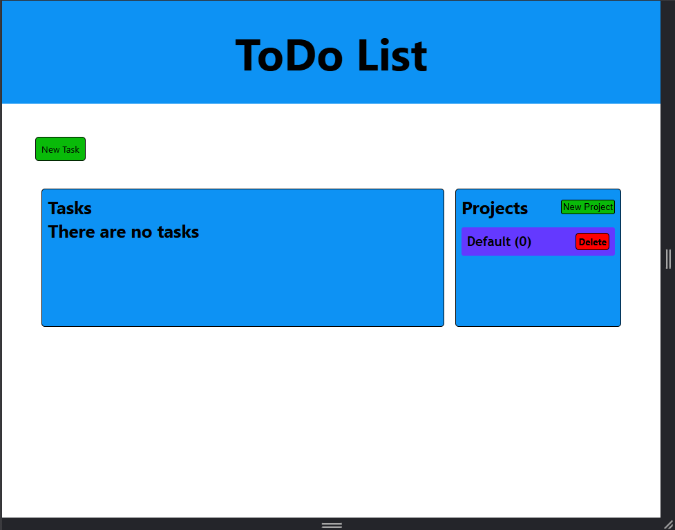
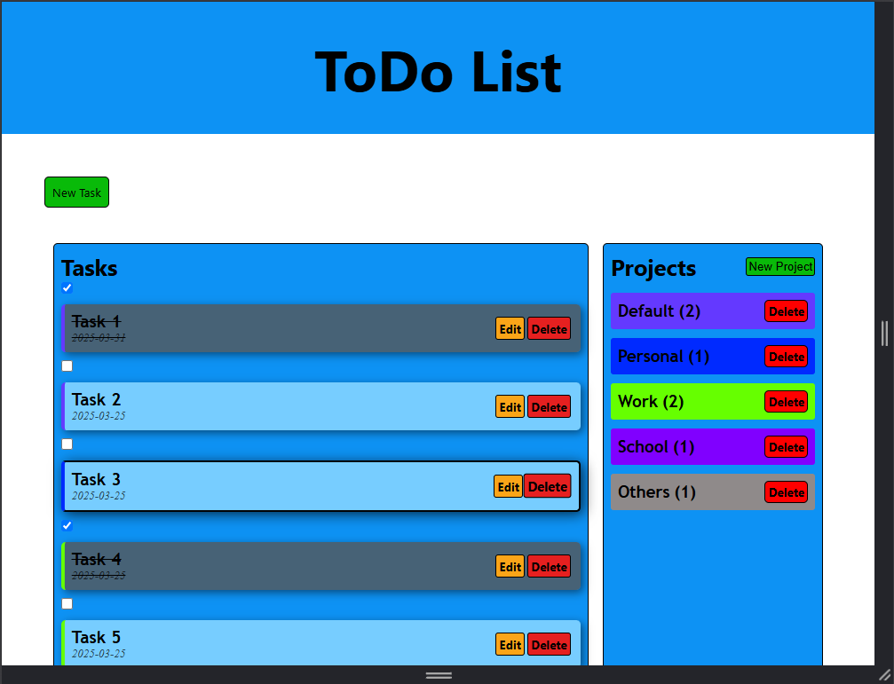
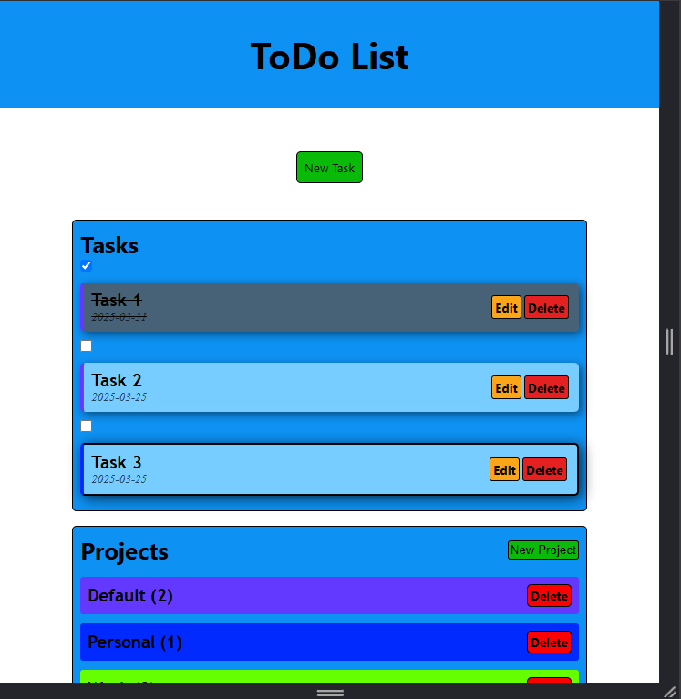
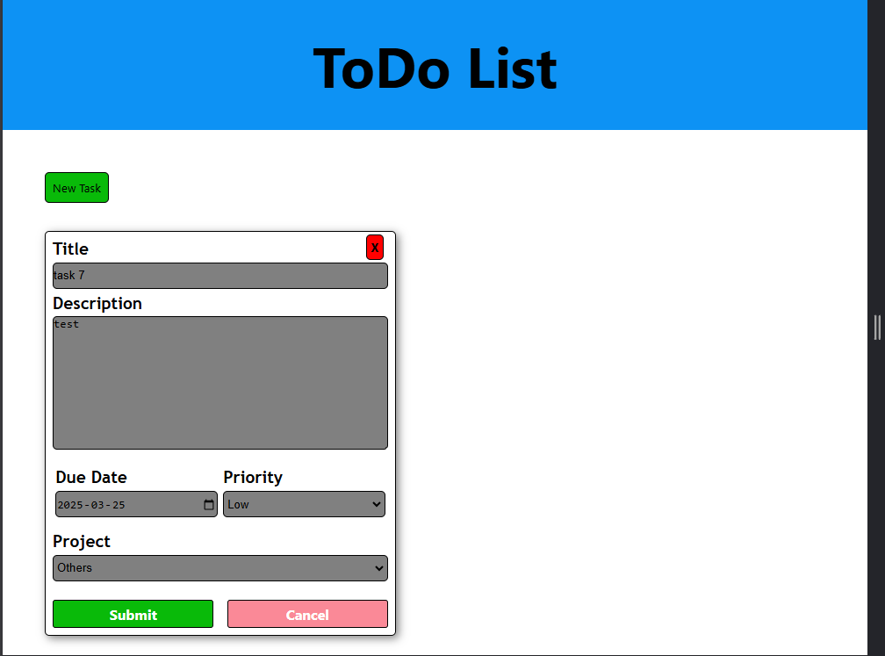
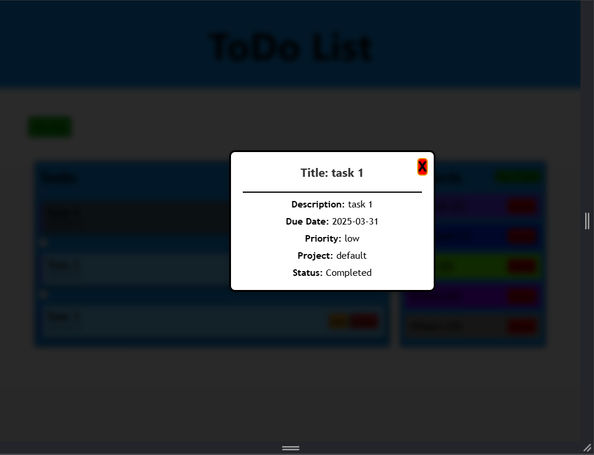
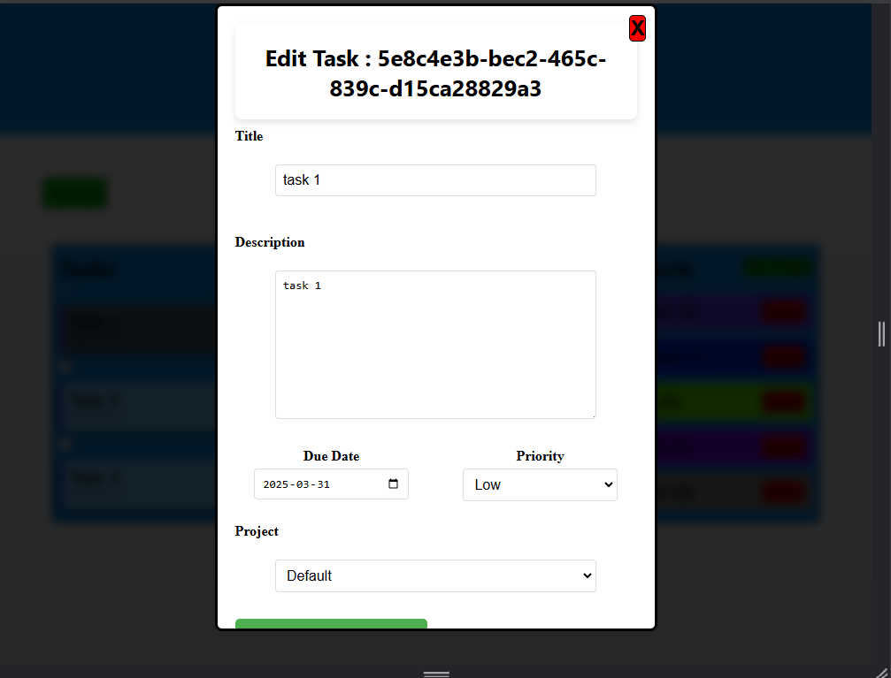
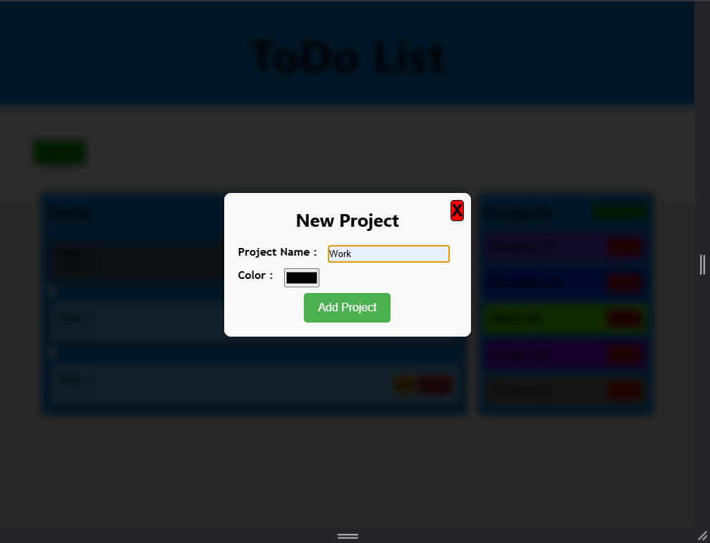
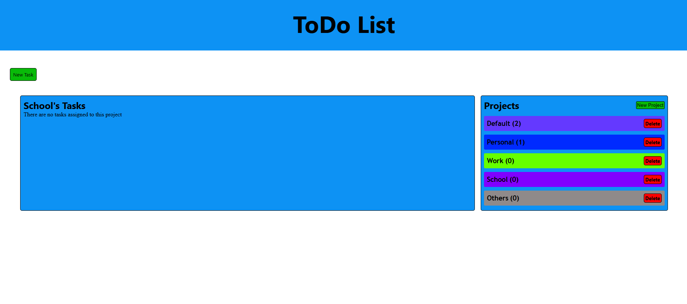

# ToDo List
Ce projet est réalisé dans le cadre du parcours Full Stack Developer de [The Odin Project](https://www.theodinproject.com/lessons/node-path-javascript-todo-list). Il s'agit d'un To-do list réaliser avec JavaScript.

## 🌐Démo
Démo ici: [Live](https://lil-code30.github.io/To-Do_List/)

## 📺 Résultat
div align="center">

<em> Aperçu du projet</em>

  
   
  
   
  
   
  
   
  
   
  
   
  
   
  
   

